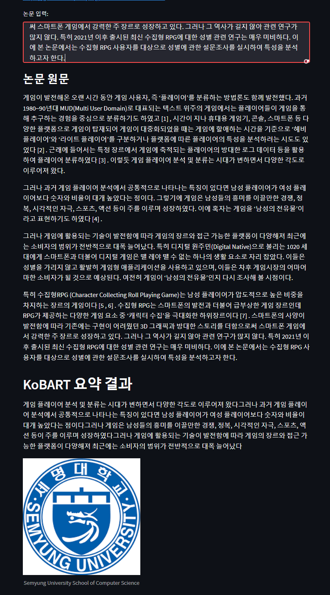

# KoBART-summarization-AIHUB
## 2022 HCLT 포스터 발표 Accepted
## 본 Repository는 seujung님의 KoBART-summarization Repository를 Fork한 것입니다. 

기존 데이터 (https://github.com/seujung/KoBART-summarization/tree/main/data) 로 학습된 모델을 AIHUB의 논문요약 데이터로 Fine-tuning 시킵니다. <br>
도움 받은 seujung님과 Ju-ing( http://blog.ju-ing.com/ )님께 감사의 말씀을 드립니다.
<br>
참고 : http://blog.ju-ing.com/posts/KoBART-summarization/

## AIHUB 논문 요약 데이터
- https://aihub.or.kr/aidata/30712
- 본 데이터셋은 한국지능정보사회진흥원의 사업결과 임.
- 반드시 위의 링크를 통해서만 데이터셋을 다운로드 받아야 함.
- 만약 본 Github 저장소에 허가되지 않은 데이터셋이 존재한다면, jasonjun1121@gmail.com 으로 메일 부탁드리겠습니다.
## Load KoBART
- huggingface.co에 있는 binary를 활용
  - https://huggingface.co/gogamza/kobart-base-v1

## Download binary
```python
import torch
from transformers import PreTrainedTokenizerFast
from transformers import BartForConditionalGeneration

tokenizer = PreTrainedTokenizerFast.from_pretrained('digit82/kobart-summarization')
model = BartForConditionalGeneration.from_pretrained('digit82/kobart-summarization')

text = """
1일 오후 9시까지 최소 20만3220명이 코로나19에 신규 확진됐다. 또다시 동시간대 최다 기록으로, 사상 처음 20만명대에 진입했다.
방역 당국과 서울시 등 각 지방자치단체에 따르면 이날 0시부터 오후 9시까지 전국 신규 확진자는 총 20만3220명으로 집계됐다.
국내 신규 확진자 수가 20만명대를 넘어선 것은 이번이 처음이다.
동시간대 최다 기록은 지난 23일 오후 9시 기준 16만1389명이었는데, 이를 무려 4만1831명이나 웃돌았다. 전날 같은 시간 기록한 13만3481명보다도 6만9739명 많다.
확진자 폭증은 3시간 전인 오후 6시 집계에서도 예견됐다.
오후 6시까지 최소 17만8603명이 신규 확진돼 동시간대 최다 기록(24일 13만8419명)을 갈아치운 데 이어 이미 직전 0시 기준 역대 최다 기록도 넘어섰다. 역대 최다 기록은 지난 23일 0시 기준 17만1451명이었다.
17개 지자체별로 보면 서울 4만6938명, 경기 6만7322명, 인천 1만985명 등 수도권이 12만5245명으로 전체의 61.6%를 차지했다. 서울과 경기는 모두 동시간대 기준 최다로, 처음으로 각각 4만명과 6만명을 넘어섰다.
비수도권에서는 7만7975명(38.3%)이 발생했다. 제주를 제외한 나머지 지역에서 모두 동시간대 최다를 새로 썼다.
부산 1만890명, 경남 9909명, 대구 6900명, 경북 6977명, 충남 5900명, 대전 5292명, 전북 5150명, 울산 5141명, 광주 5130명, 전남 4996명, 강원 4932명, 충북 3845명, 제주 1513명, 세종 1400명이다.
집계를 마감하는 자정까지 시간이 남아있는 만큼 2일 0시 기준으로 발표될 신규 확진자 수는 이보다 더 늘어날 수 있다. 이에 따라 최종 집계되는 확진자 수는 21만명 안팎을 기록할 수 있을 전망이다.
한편 전날 하루 선별진료소에서 이뤄진 검사는 70만8763건으로 검사 양성률은 40.5%다. 양성률이 40%를 넘은 것은 이번이 처음이다. 확산세가 계속 거세질 수 있다는 얘기다.
이날 0시 기준 신규 확진자는 13만8993명이었다. 이틀 연속 13만명대를 이어갔다.
"""

text = text.replace('\n', ' ')

raw_input_ids = tokenizer.encode(text)
input_ids = [tokenizer.bos_token_id] + raw_input_ids + [tokenizer.eos_token_id]

summary_ids = model.generate(torch.tensor([input_ids]),  num_beams=4,  max_length=512,  eos_token_id=1)
tokenizer.decode(summary_ids.squeeze().tolist(), skip_special_tokens=True)

'1일 0 9시까지 최소 20만3220명이 코로나19에 신규 확진되어 역대 최다 기록을 갈아치웠다.'

```
## Requirements
```
pytorch>=1.10.0
transformers==4.16.2
pytorch-lightning==1.5.10
streamlit==1.2.0
```
## Data
- [Dacon 한국어 문서 생성요약 AI 경진대회](https://dacon.io/competitions/official/235673/overview/) 의 학습 데이터를 활용함
- 학습 데이터에서 임의로 Train / Test 데이터를 생성함
- 데이터 탐색에 용이하게 tsv 형태로 데이터를 변환함
- Data 구조
    - Train Data : 34,242
    - Test Data : 8,501
- default로 data/train.tsv, data/test.tsv 형태로 저장함
  
| news  | summary |
|-------|--------:|
| 뉴스원문| 요약문 |  

- 참조 데이터
  - [AIHUB 문서 요약 데이터](https://aihub.or.kr/aihubdata/data/view.do?currMenu=115&topMenu=100&aihubDataSe=realm&dataSetSn=90)
- [Dacon 한국어 문서 생성요약 AI 경진대회](https://dacon.io/competitions/official/235673/overview/) 의 학습데이터로 pretrained 된 모델에 AIHUB 문서 요약 데이터로 Fine-tuning시킴.


## How to Train
- KoBART summarization fine-tuning
```bash
pip install -r requirements.txt

[use gpu]
python train.py  --gradient_clip_val 1.0  \
                 --max_epochs 50 \
                 --default_root_dir logs \
                 --gpus 1 \
                 --batch_size 4 \
                 --num_workers 4

[use gpu]
python train.py  --gradient_clip_val 1.0  \
                 --max_epochs 50 \
                 --default_root_dir logs \
                 --strategy ddp \
                 --gpus 2 \
                 --batch_size 4 \
                 --num_workers 4

[use cpu]
python train.py  --gradient_clip_val 1.0  \
                 --max_epochs 50 \
                 --default_root_dir logs \
                 --strategy ddp \
                 --batch_size 4 \
                 --num_workers 4
```

## Model Performance
- Test Data 기준으로 rouge score를 산출함
- Score 산출 방법은 Dacon 한국어 문서 생성요약 AI 경진대회 metric을 활용함
  
| | rouge-1 |rouge-2|rouge-l|
|-------|--------:|--------:|--------:|
| Precision| 0.515 | 0.351|0.415|
| Recall| 0.538| 0.359|0.440|
| F1| 0.505| 0.340|0.415|

## Demo
- Kobertsum_finetuning_aihub.ipynb를 참고해주세요.
- 학습한 model binary 추출 작업이 필요함
   - pytorch-lightning binary --> huggingface binary로 추출 작업 필요
   - hparams의 경우에는 <b>./logs/tb_logs/default/version_0/hparams.yaml</b> 파일을 활용
   - model_binary 의 경우에는 <b>./logs/kobart_summary-model_chp</b> 안에 있는 .ckpt 파일을 활용
   - 변환 코드를 실행하면 <b>./kobart_summary</b> 에 model binary 가 추출 됨
  
```
 python get_model_binary.py --hparams hparam_path --model_binary model_binary_path
```

- streamlit을 활용하여 Demo 실행
    - 실행 시 <b>http://localhost:8501/</b> 로 Demo page가 실행됨
```
streamlit run infer.py
```

- Demo Page 실행 결과
  - [원문링크](https://www.mk.co.kr/news/society/view/2020/12/1289300/?utm_source=naver&utm_medium=newsstand)
  


* https://www.dbpia.co.kr/journal/articleDetail?nodeId=NODE11039042

## Reference
- [KoBART](https://github.com/SKT-AI/KoBART)
- [KoBART-chatbot](https://github.com/haven-jeon/KoBART-chatbot)
- [AIHUB 논문 요약 데이터](https://aihub.or.kr/aihubdata/data/view.do?currMenu=115&topMenu=100&aihubDataSe=realm&dataSetSn=90)
